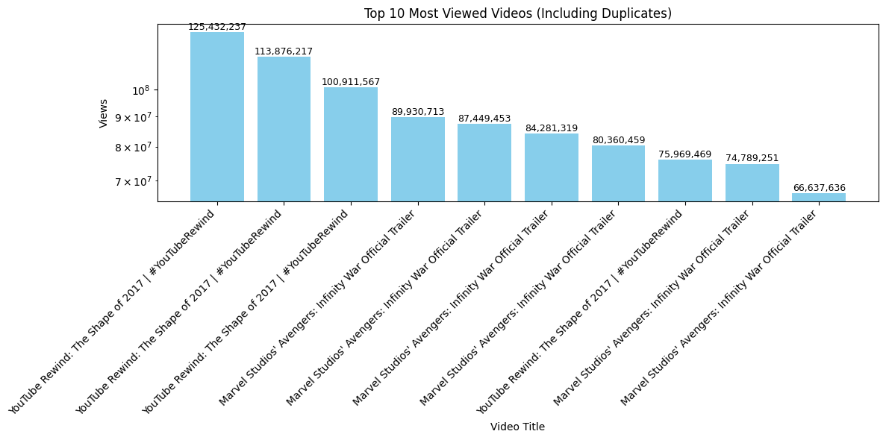
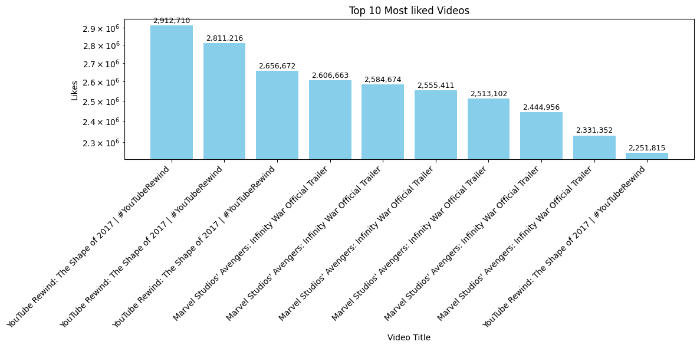
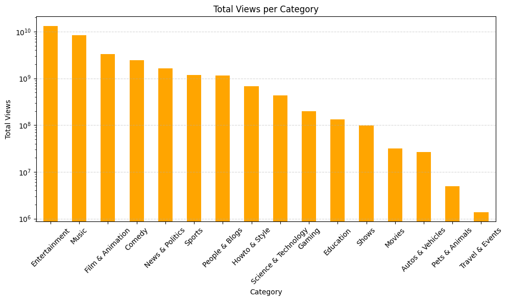
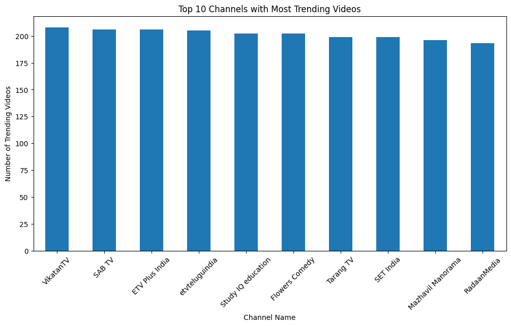
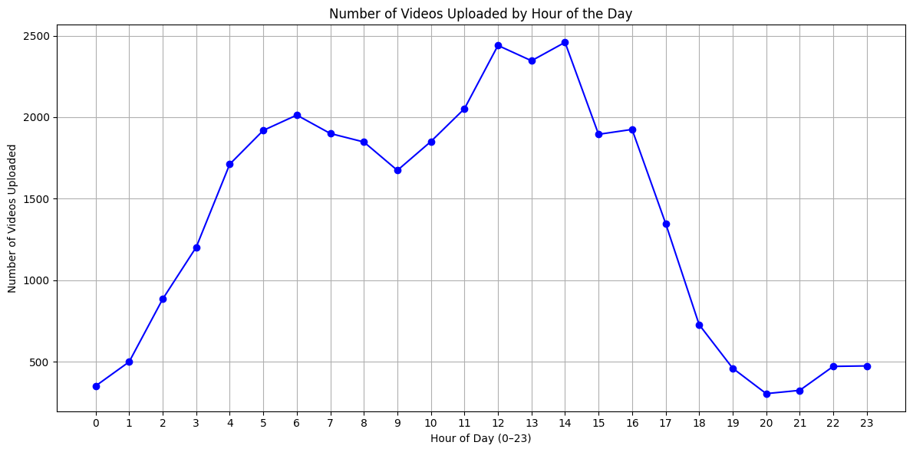

## Visualizations Included
- Bar charts Top10_(Most_viewed, Top10_most_liked, Top10_channel_trending_videos , viewspercategory)
- Line chart (Upload trends by hour)
- Scatter plot (Likes vs views)
- Word cloud (Tags)

---

##  Sample Visualizations

###  Top 10 Most Viewed Videos

###  Top 10 Most liked Videos

###  Views per category

###  Number of trending videos in top10_channel

###  Upload Time Distribution

###  Most Common Tags (Word Cloud)

---

## 🧠 Key Insights
- [✅] Certain categories (e.g. Entertainment, Music) dominate trending videos
- [✅] Most uploads happen between X-Y hours
- [✅] Strong correlation found between likes and views
- [✅] Some tags like "Funny", "Show", and "Comedy" are highly frequent
